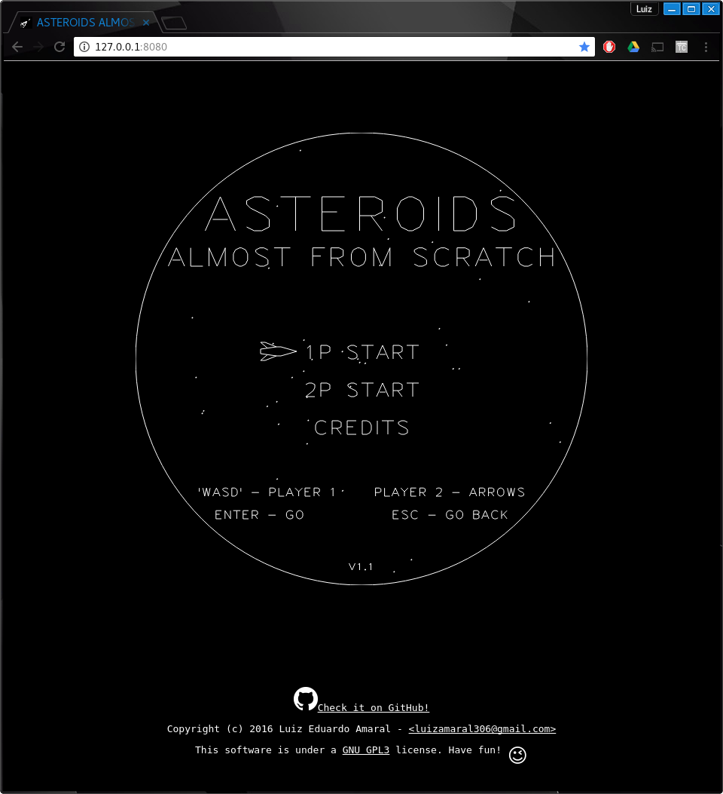
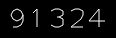

# ASTEROIDS ALMOST FROM SCRATCH
This is an attempt of reproducing the game [asteroids](https://en.wikipedia.org/wiki/asteroids!) using modern programming languages. The idea is to track the progress and time each stage of development in this document. If possible, I want to finish this project in under 24h.

#### Check it out [here](https://armlessjohn404.github.io/asteroids-almost-from-scratch/)

The game is based in `html5 canvas`, `CSS` and `ES6 javascript`. No extra libraries or engines will be used.

Since I've already worked on a project to reproduce [spacewar-almost-from-scratch](https://armlessjohn404.github.io/spacewar-almost-from-scratch/), I'll be using much of it in here. If you want to see how it was done, check it out on [GitHub](https://github.com/ArmlessJohn404/spacewar-almost-from-scratch).

## GOALS
* ~~Add `LICENSE.md` and `README.md~~
* ~~Copy the `spacewar` files~~
* ~~Host somewhere~~
* ~~Make screens square~~
* ~~Remove gravity, player2 and `blackhole`~~
* ~~Modify `Ship` class~~
* ~~Modify `Shot` class~~
* ~~Create `Asteroid` class~~
* ~~Draw asteroids~~
* ~~Create `Saucer` class~~
* ~~Draw saucers~~
* ~~Create `Score` class~~
* ~~Modify collision mechanics~~
  * ~~Collision with borders~~
  * ~~Collision Asteroid-Player~~
  * ~~Collision Shot-Asteroid~~
  * ~~Collision Saucer-Shot~~
  * ~~Collision Saucer Player~~
  * ~~Collision Saucer Shot-Player Shot~~
  * ~~Collision Saucer Shot-Player~~
* Create Asteroid breaking mechanics
* Create level mechanics
* Create life mechanics
* Create High scores screen
* Find someplace to host High scores
* Modify `start screen`
* Modify `credits screen`
* Modify `game over screen`
* Modify sounds
* Improve webpage
* Get play testers feedback
* List requests/bugs
* Fix requests/bugs
* Finished!

## Progress Reports
00:00 - Start! This project started October 23rd, 2016 at 17:30 (BRT). I'll be timing each step and will be placing the time it took from the beginning along with the achieved goal.

## 00:10 - LICENSE and README
This project is under a [GNU GPL3](https://www.gnu.org/licenses/gpl-3.0.en.html) license. Have fun! :wink:

## 00:15 - Host somewhere
For now, I'll be hosting it in [github pages](https://pages.github.com/) since it's easy deploy. Check it out [here](https://armlessjohn404.github.io/asteroids-almost-from-scratch/)

## 00:30 - Copy the `spacewar` files
Since this game is also made with vector graphics, I copied the [spacewar](https://armlessjohn404.github.io/spacewar-almost-from-scratch/) I made to the project folder and changed the favicon, the main color and a few tweaks. In the end it was looking like this:



## 00:45 - Make screens square
Asteroids have a square screen, so I removed the stars and the round mask of the spacewar.

## 01:00 - Remove gravity, player2 and `blackhole`
The game does not have the `blackhole` (star) in the middle as `Spacewar` has, so it has been removed along with the gravity mechanics. Also, I don't want to add a 2 player mode because in the original game the players took turns playing. Instead I'll try to make a online highscore.

## 01:20 - Modify `Ship` class
The ship sprite is much simpler in Asteroids. So it was easy to draw: 
. I changed some properties to make the ship more agile and interesting to play.
```javascript
const player1Vectors = [[[5, 0], [-4, -3], [-3, -2], [-3, 2], [-4, 3], [5, 0]]];
```

## 01:30 - Modify `Shot` class
The shots were also easy. I just changed some properties and done.

## 02:50 - Create `Asteroid` class and draw asteroids
To create the asteroid class, I inherited the `BaseClass`. The only addition was a rotation speed property that makes the asteroid spins continuously.

To draw the asteroids, I made a function that randomly generates points in a grid and used those vectors.

```javascript
function makeAsteroidVectors() {
  let vectors = [randomCoords(0, 0), randomCoords(1, 0), randomCoords(2, 0), randomCoords(3, 0),
                 randomCoords(3, 1), randomCoords(2, 1), randomCoords(3, 2), randomCoords(3, 3),
                 randomCoords(2, 3), randomCoords(1, 3), randomCoords(0, 3), randomCoords(0, 2),
                 randomCoords(0, 1)];
  vectors.push(vectors[0])
  return [vectors];
}
```

Luckly for me, in the constructor, I have made the vectors translate to make the centroid of the object the coordinates (0, 0), then it's easy to rotate the object around the centroid. And there's also a scaler in the constructor to chose the size of the objects which came in handy to make asteroids of different sizes.
This is the end result


## 03:10 - Create `Saucer` class and draw saucers
Instead of making a `Saucer` class, I'm recycling the `Ship` class and will control it in the gameloop.
The vectors for the
 are:
```javascript
const saucerVectors = [[[-1, 0], [1, 1], [5, 1], [7, 0], [5, -1], [1, -1], [-1, 0]],
                       [[2, 1], [2.5, 2], [3.5, 2], [4, 1]],
                       [[-1, 0], [7, 0]]];
```

## 03:20 - Create `Score` class
The score class is super simple, it took 10 min to make and test it.


```javascript
class Score {
  constructor(x, y, size) {
    this.x = x;
    this.y = y;
    this.size = size;
    this.score = 0;
  }
  draw() {
    writeText(this.x, this.y, this.score.toString(), this.size);
  }
}
```
I thought about making the score like the original game, but I really liked working with the [Hershey Vector Font](http://paulbourke.net/dataformats/hershey/).

## 03:25 - Modify collision mechanics - Collision with borders
It was changed in the `update` method of `BaseSprite` the way the game computes a collision with the borders.
```javascript
// border collision
if (this.x < 0) this.x = 600;
if (this.x > 600) this.x = 0;
if (this.y < 0) this.y = 600;
if (this.y > 600) this.y = 0;
```
## 04:10 - Modify collision mechanics - Collision Asteroid-Player
Since the collision function was implemented in `Spacewar`, it was easy to calculate the collisions with the asteroids. I just had to add a conditional to make the asteroids split in smaller ones.

## 05:00 - Modify collision mechanics - Collision Asteroid-Shot
The collision mechanics were easy to implement again, but this part took a while longer because I wasn't using correctly the splice method and along with the non-blocking property of JavaScript I was getting lots of bugs.

## 05:20 - Modify collision mechanics - Collision Saucer
The last part of the collisions was easier because there were code from Spacewar that did exactly that.
